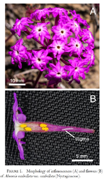
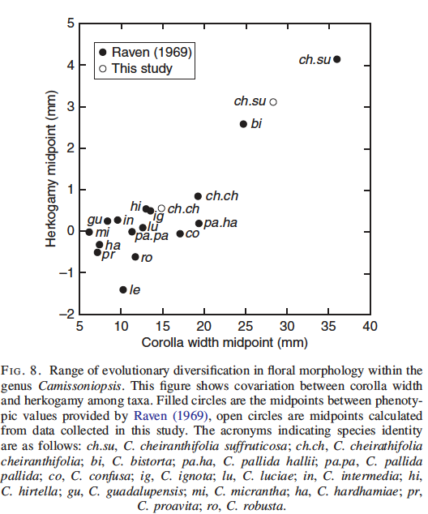

# Coding Challenge 4: Populations, distributions and samples

## Background & Relevance

Pollinators are essential for maintaining biodiversity and global food security, yet their populations are declining worldwide due to habitat loss, pesticide use, and climate change. This decline threatens not only wild plant species but also agricultural systems that depend on pollination services. Understanding how plants adapt to reduced pollinator availability is relevant to several UN Sustainable Development Goals (SDGs), including:

- **SDG 15: Life on Land** – Conserving biodiversity and ecosystem resilience.
- **SDG 2: Zero Hunger** – Ensuring sustainable food production systems.
- **SDG 13: Climate Action** – Anticipating ecological responses to climate-driven pollinator loss.

One possible adaptation to pollinator decline is a shift in mating systems. Plants that are self-incompatible (SI) require pollinators for reproduction, whereas self-compatible (SC) plants can self-fertilize when pollinators are scarce. However, selfing often comes at a cost: reduced genetic diversity and potential inbreeding depression.

In this challenge, you will analyze floral trait data from populations of a coastal dune plant that vary in mating system. Traits such as flower size, number, and arrangement influence pollinator attraction and efficiency. By comparing SI and SC populations, you will explore how mating system shifts might affect floral traits—and what this means for plant adaptation in a world with fewer pollinators. 

## The study

You will use a dataset from a study of variation in floral morphology across the geographic range of the Pacific coast dune endemic plant *Abronia umbellata* (Nyctaginaceae). These were collected as part of a study by Laura Doubleday in Chris Eckert's lab at Queen's University.



Across its coastal range *Abronia umbellata* exhibits striking variation in self-incompatibility (SI), a physiological response that prevents a plant being fertilized by its own pollen. Because plants are usually hermaphroditic, SI has evolved to prevent the production of genetically inferior selfed offspring. However, under certain ecological conditions (e.g. scarce pollinators, low density of compatible conspecific mates) self-fertilization may be favoured by natural selection, resulting in the evolution of self-compatible (SC) populations. The dataset you will analyze contains data on flower and inflorescence morphology measured on a random sample of plants from 12 sites, from just north of Los Angeles California to the species northern range limit in southern Oregon. Most of the populations contain SI plants but some contain SC plants.

You are going to evaluate two hypotheses:

1. SC evolves towards geographical range limits where mate density and possibly pollinator service is particularly low.
2. Once SC evolves, selection favours reduced investment in floral traits that attract pollinators because a selfing individual does not require assisted pollination.

With this dataset, we'll explore the properties of distributions, and use ggplot and central moments to compare the distributions of different populations. The questions in the template ask what they tell you about the two **populations** they were drawn from — their distributions, their means and how much variation there is around them, how confident you can be in those means, and whether they differ.

## Dataset description

The file `AbroniaFloralData.csv` has one row per plant. Here's what's in the data set:

- `self_inc` = An indication of whether the plant comes from a self-incompatible (SI) or self-compatible (SC) population
- `site` = The code for the coastal site where the data were collected
- `latitude_N` = The latitude of the site (in ° N). Note that all plants at the same site have the same value for latitude.
- `plant_id` = The unique identifier for each plant
- `umbel_angle_deg` = Umbel angle measured in degrees. This measure indicates how spread out the flowers in an inflorescence are (see photo above). The greater the angle, the more spread out and available to pollinators the individual flowers in an inflorescence are.
- `flower_number` = The number of flowers in an inflorescence. More flowers make an inflorescence more attractive to pollinators, so we might expect flower number to decline in conjunction with the evolution of selfing.
- `face_diam_mm` = Flowers are tubular with a wide face, the diameter of which is measured here. In the picture of the inflorescence above the flowers are facing you. Larger faces are expected to be more attractive for pollinators.
- `tube_length_mm` = You can see in the cross-sectional photo that flowers have a long tube, which is measured here from the opening at the face to the bottom of the tube.

## Figures

All the graphs for this course must be outfitted with axis titles that include appropriate units. Axis titles are sentence case (i.e., capitalize the first word of the title only, unless proper nouns are involved). Each figure must also have a figure caption that adequately describes the figure and any special symbols used. The caption needs to be concise but complete. See the example below, and take a look at the following two links for guidance:

- [How to write a figure caption](https://www.internationalscienceediting.com/how-to-write-a-figure-caption/)
- [Guidelines for Using Figures and Tables in a Scientific or Engineering Thesis](https://gradstudents.carleton.ca/2014/guidelines-using-figures-tables-scientific-engineering-thesis/)



## Using the template

1. **Get organized.** Create a new project folder for this challenge (`New → New Folder from Template → R Project`), and add a `data` folder inside it.
2. **Download the assignment files from OnQ:** the template `BIOL343-CC4-template.Rmd` (save it in the project folder and **rename it**, e.g. `Group_#_CC4.Rmd`) and the data file `AbroniaFloralData.csv` (save it in `data`). Keep the data file name exactly as it is, and **do not edit the data file by hand**.
3. **Open your project folder in Positron** (`File → Open Folder…`) so that the relative path `data/AbroniaFloralData.csv` works.
4. **Start your coding log** by following the **DO THIS FIRST** block at the top of the template, before you write any code.
5. **Work through each numbered section.** Write your code in the chunk, run it, and read the output before moving on. Where the template asks a **Question**, type your answer on the **Answer:** line as ordinary text, outside the code chunk. Several sections ask you to calculate something *from the equation* before using the R function that does it; both are required — the point is to see that they are the same calculation.
6. **Knit as you go.** Run `rmarkdown::render("Group_#_CC4.Rmd")` in the Console (with your file's name). Fix any error before adding more code. Before you upload, open the `.html` in a web browser and check that the figures are visible and that Section 10 shows a figure and caption but no code: the **Render** button in Positron can write figures to a separate folder, in which case the uploaded file shows a broken image.
7. **Finish as a group.** Compare your individual versions, agree on one, knit it, and upload **both** the `.Rmd` and the `.html`, named `Group_#_CC4.Rmd` and `Group_#_CC4.html` (your group number in place of `#`).

## Your coding log (positpal)

The routine is the same as the earlier challenges, and the commands are in the template under **DO THIS FIRST** and **DO THIS LAST**. Copy and paste them into the R Console; they are not code chunks and must not be added as code chunks.

With your project folder open in Positron (so that it is your working directory) and the template saved there under the name you will upload, start your log **before you write any code**, replacing `FILENAME.Rmd` with that file name:

```
install.packages("remotes")
remotes::install_url("https://quantitative.bio/downloads/positpal.tar.gz", upgrade = "never")
positpal::start("FILENAME.Rmd")
```

Check that autosave is on in Positron (*File → Auto Save*). The first time you use positpal on a computer, `start()` will ask you to run `positpal::accept_eula()` once; do that, then run the `start()` line again. Run the `start()` line again every time you sit down to work on the file, and check after a few minutes that the `.capture/snaps` folder in your project is filling up. If `start()` refuses to record, run `positpal::doctor("FILENAME.Rmd")` and bring the output to tutorial or office hours. positpal records every file in the project folder, so keep only this challenge's files in it.

When you are finished (after the group's final knit), each group member runs:

```
positpal::stop_capture()
positpal::export_capture()
```

`export_capture()` prints the name and location of the `my-capture-YYYYMMDD-HHMMSS.zip` it creates beside your `.Rmd`; that is your coding log. Upload it to **CC4 — Coding Log (individual)**. If `export_capture()` fails, zip the `.capture` folder yourself and upload that instead.

Stuck on an error? Run `positpal::coach_brief()` and paste the text it prints into the course Coding Coach (OnQ → Course Help) along with your questions. If that doesn't help you address the problem, then email the entire Coding Coach conversation to the course instructor.

## Submission

- **One per group:** upload `Group_#_CC4.Rmd` **and** `Group_#_CC4.html` to your section's folder — **TUT02-CC4** (section 002) or **TUT03-CC4** (section 003). Submitting to the wrong section's folder, or with a group you were not assigned to, carries the penalty described in the syllabus.
- **One per person:** upload your `my-capture-….zip` to **CC4 — Coding Log (individual)**. Upload the `.zip`, not your `.Rmd`.
- Coding challenges are graded 0–5 for completeness.

Friendly reminder: to avoid losing marks, be sure to include the full names and student IDs of each group member at the top of your submitted document. You may complete this assignment individually if you have accommodations or extenuating circumstances.
